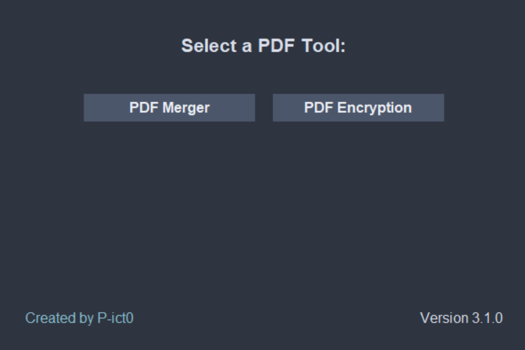

<div align = center>

# 🖨️ PDF Tools App 🖨️

**A local, offline and more simple imitation of [iLovePDF](https://www.ilovepdf.com/)**

<p align="center">
  
</p>

![Badge Workflow]
[![Badge License]][License]
![Badge Language]
[![Badge Pull Requests]][Pull Requests]
[![Badge Issues]][Issues]

<br>

</div>

# Contents

- [📖 Description](#-description)
- [🚀 Quick Start](#-quick-start)
- [✨ Features](#-features)
- [🖼️ Screenshots](#%EF%B8%8F-screenshots)
- [📦 Installation](#-installation)
- [🗑️ Uninstall](#%EF%B8%8F-uninstall)
- [💻 Development](#-development)
- [👥 Contributing](#-contributing)

# 📖 Description

💻 **Windows, Linux and Mac compatible.** 💻

The PDF Tools App is a simple, offline and local and cross-platform desktop application that allows you to manipulate PDF files. Built with `Tkinter` for GUI and `PyPDF2` for PDF processing, this app currently supports Windows, macOS, and Linux. So you don't have to upload your PDF files to the web.

**Basically, an app that you can install locally on your system similar to [iLovePDF](https://www.ilovepdf.com/), but works offline and is much simpler.**

# 🚀 Quick Start

Download the latest release from the [**releases**](https://github.com/P-ict0/pdf-tools-app/releases).

(More info at [INSTALL.md](./INSTALL.md))

# ✨ Features

Right now, the app supports the following features:

- **PDF Merger**: Merge multiple PDF files into a single PDF file.
- **PDF Encryptor**: Encrypt a PDF file with a password.
- **PDF Compressor**: Compress your PDFs.

# 🖼️ Screenshots

For screenshots of all the tools a look at [DEMO.md](./DEMO.md)

# 📦 Installation

For OS-specific installation instructions, please refer to the [INSTALL.md](./INSTALL.md) file.

You can also clone the repository and run the app locally.

# 🗑️ Uninstall

Refer to the [INSTALL.md](./INSTALL.md) file for OS-specific uninstallation instructions.

# 💻 Development

1. **Clone the repository**:

   ```bash
   git clone https://github.com/your-username/pdf-tools-app.git
   cd pdf-tools-app
   ```

2. **Install dependencies**: (You might want to use a virtual environment)

   ```bash
   pip install -r requirements.txt
   ```

3. **Run**:
   ```bash
   python src/app.py
   ```

# 👥 Contributing

Contributions are welcome! Feel free to open issues or submit pull requests to help improve functionality, design, or cross-platform compatibility.

<!----------------------------------------------------------------------------->

[Pull Requests]: https://github.com/P-ict0/pdf-tools-app/pulls
[Issues]: https://github.com/P-ict0/pdf-tools-app/issues
[License]: LICENSE

<!----------------------------------{ Badges }--------------------------------->

[Badge Workflow]: https://github.com/P-ict0/pdf-tools-app/actions/workflows/build.yml/badge.svg
[Badge Issues]: https://img.shields.io/github/issues/P-ict0/pdf-tools-app
[Badge Pull Requests]: https://img.shields.io/github/issues-pr/P-ict0/pdf-tools-app
[Badge Language]: https://img.shields.io/github/languages/top/P-ict0/pdf-tools-app
[Badge License]: https://img.shields.io/github/license/P-ict0/pdf-tools-app
[Badge Lines]: https://img.shields.io/tokei/lines/github/P-ict0/pdf-tools-app
